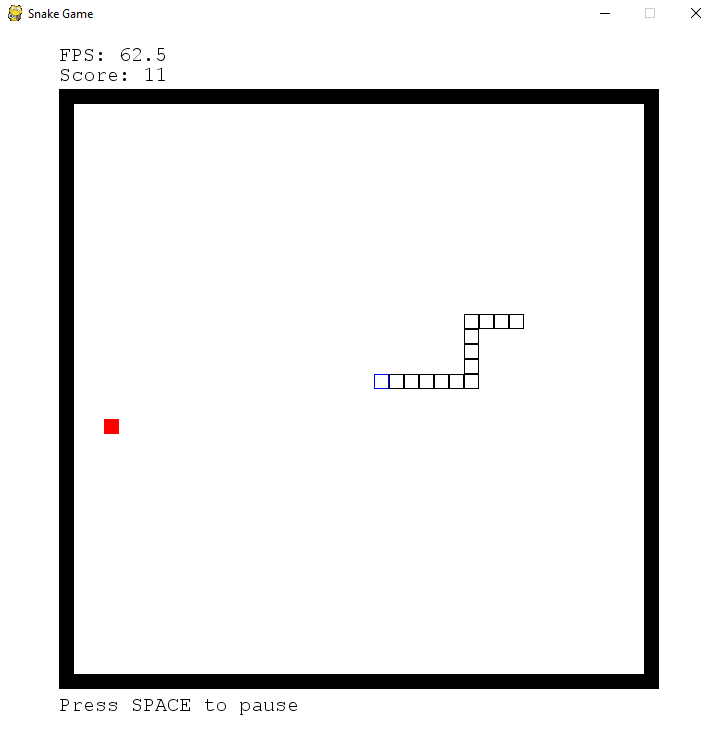
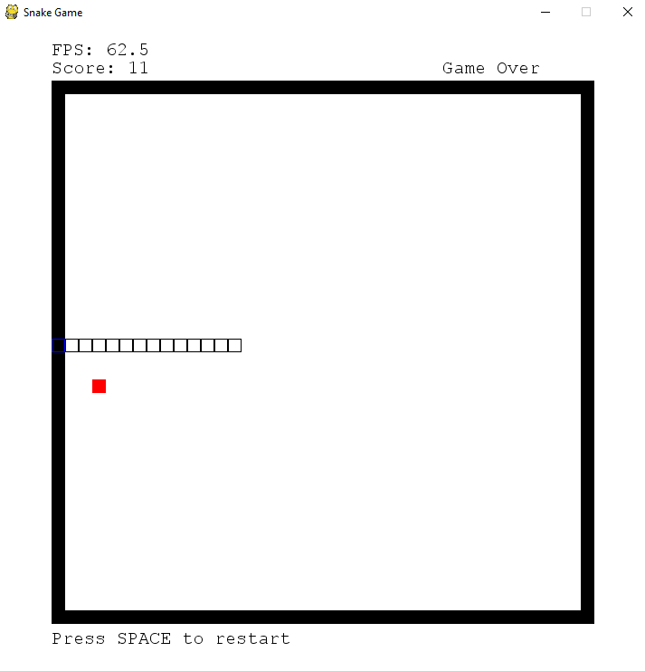

#snake-game
A simple Snake Game in a 720x720 windows with a 38x38 usable map. The game was developed with pygame modules. This project will probably be used as a testing environment for Machine Learning.

Objective: The player is a snake and it must collect the red squares to grow longer, the snake will expire if it collides with a wall or with itself (its own segments).

Arrow keys to move and space bar to pause/resume/restart the game.

